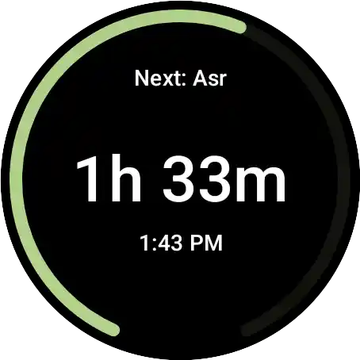

<h1 align="left">SimplePrayer</h1>

> A privacy-first, Material Design compliant, standalone Wear OS App.

This is a Wear OS app for calculating prayer times completely on device, without relying on a phone companion app or internet access.
It comes with an assortment of tiles and complications for at-a-glance information.

Support for multiple calculation methods, including overrides for custom adjustments.

Built on Kotlin, Jetpack Compose, as well as other components that (mostly) follow the recommended app architecture for Android applications.

# Images
> [!NOTE]
> These are assets from the app that are likely to be changed

    
    

# Getting Started

Build the project via `./gradlew build`, or directly import the project into Android Studio.

# Built with

- [Android Jetpack](https://developer.android.com/jetpack) - Specifically the libraries focused on Wear OS
- [Horologist](https://github.com/google/horologist) - Handy Wear OS library collection for bleeding edge features
- [Accompanist](https://github.com/google/accompanist) - Same as Horologist but for Jetpack Compose
- [Adhan Kotlin Multiplatform](https://github.com/batoulapps/adhan-kotlin) - For calculating prayer times
